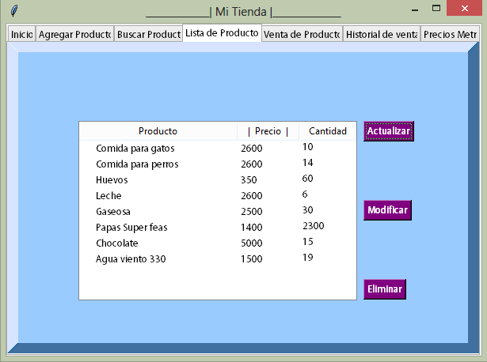
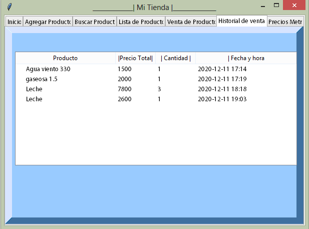
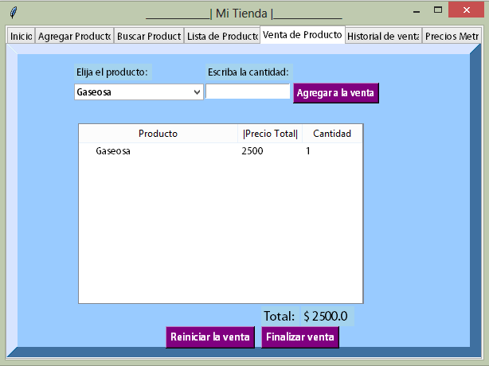

Nombre Proyecto: Inventario de una tienda

grupo: #10

Integrantes:
1. Yeison Dario Rojas Mora
2. Manuel Fernando Vasquez Vasquez

Objetivo: Programa que permite almacenar información de productos, y luego hacer operaciones contables con estos datos

Información básica para ejecutar programa:
- instalar la libreria beautiful soup abriendo la consola de comandos y ejecutando el siguiente codigo "pip install beautifulsoup4"
- Descargar la carpeta "Codigo_fuenteFinal" y abrir archivo .py, mantener los elementos de la carpeta juntos de lo contrario no se ejecutará.

